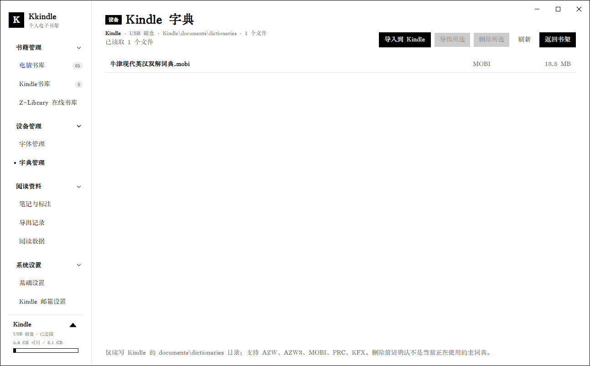
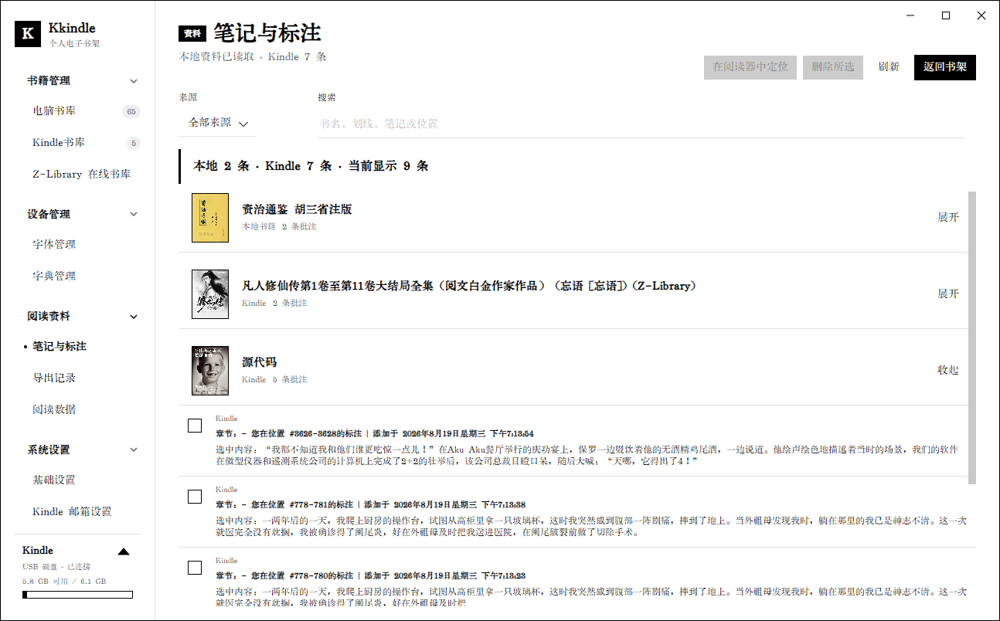
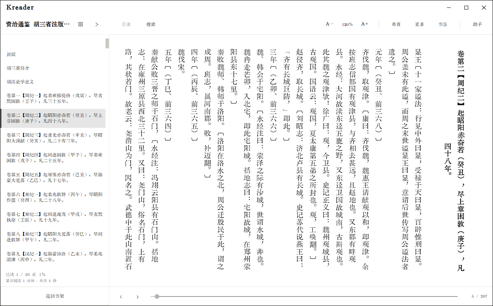
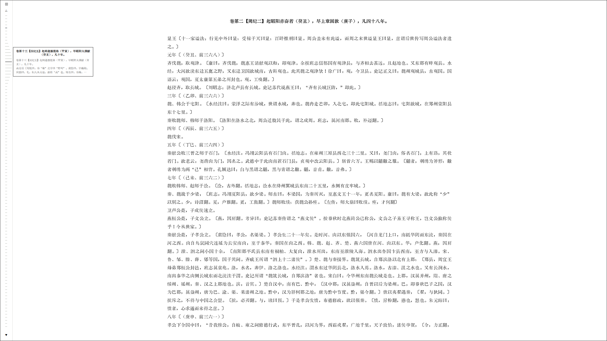
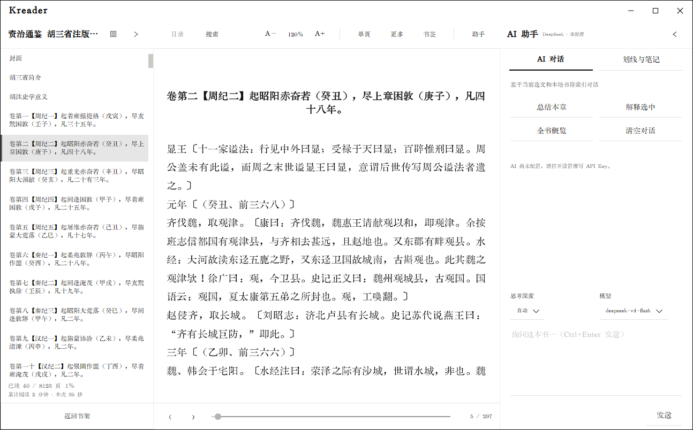
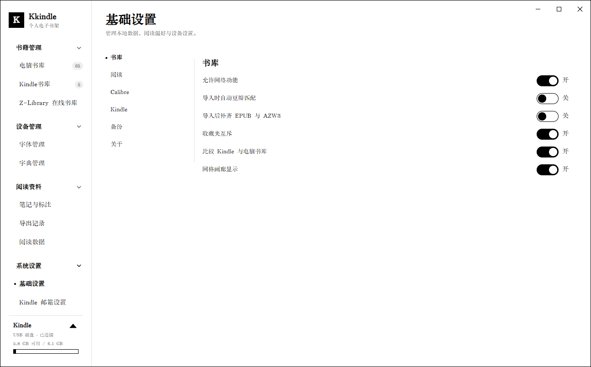

# Kkindle

[](https://github.com/kingstacker/Kkindle/actions/workflows/release.yml)
[](https://github.com/kingstacker/Kkindle/releases/latest)

[简体中文](README.zh-CN.md) · [English](README.md)

Kkindle 是一款面向 Windows、Linux 和 macOS 的个人电子书与 Kindle 设备管理器。它使用 Avalonia 构建，将本地书库、格式转换、阅读、批注、AI 辅助阅读和 Kindle 传输集中在一个简洁的灰白纸张风格界面中。

首次启动时会显示两步欢迎向导：第一步选择界面语言，默认根据系统语言自动选择简体中文或 English；第二步选择 Kindle 品牌和设备型号。向导完成后可在设置和设备卡片中继续修改这些选项。

## 三端状态

| 平台 | 基本测试 | 平台验证 | 当前状态 |
| --- | --- | --- | --- |
| Windows 11 x64 | 已完成：Release 构建、自动化测试、Windows 安装包冒烟测试 | 已在 Windows 11 实机测试 | 基本功能可用，可发布 |
| Linux x64 | 已完成：Release 构建、公共平台测试、Linux 包启动冒烟测试 | 已在 Debian 13 实机测试 | 基本功能可用，可发布 |
| macOS Intel/Apple Silicon | 已完成：Release 构建与签名/包校验流程 | 尚未进行 macOS 实机测试 | 可生成发布包，等待实机验证 |

macOS 当前发布包未宣称经过实际设备验证；正式使用前请先在目标 macOS 版本上验证启动、阅读器和 Kindle USB 挂载功能。

## 界面预览

### 电脑书库


### 画廊模式


### 电脑书库（右键菜单）


### 豆瓣封面匹配


### Kindle 书库管理


### Kindle 字体与词典管理



### 笔记与标注



### Kreader 阅读器



### Kreader 禅模式



### AI 阅读助手



### Z-Library 在线书库


### 基础设置



## 主要功能

### 首次运行与双语界面

- 首次进入主界面时显示欢迎向导，支持在应用内切换简体中文和 English。
- 系统语言为中文（`zh-*`）时默认使用简体中文；其它系统语言默认使用 English。
- 第二步向导支持选择 Kindle 品牌和型号，并保存为默认设备型号；连接具体设备后仍可单独记忆该设备的型号。
- 界面语言可稍后在设置中切换，切换会立即刷新主要界面、阅读器、状态提示和设备选择项。

### 本地书库管理

- 导入 EPUB、PDF、MOBI 和 AZW3，支持拖放导入与中文文件名；导入文件夹时可逐本选择是否自动补齐 EPUB/AZW3 格式。
- 自动解析 EPUB 的标题、作者、简介和封面，使用 SHA-256 去重，并把同一本书的不同格式统一归档。
- 提供标题/作者搜索、作者/标签/格式/分类/阅读状态筛选、收藏筛选和多种排序方式。
- 支持分类、收藏、待读/阅读中/已读状态管理；开始阅读和读完时会自动更新状态。
- 提供书架、列表和画廊显示模式；单击书籍打开详情，快速双击直接阅读，双击不会误触发详情面板。
- 支持封面、标题、作者、系列、标签、分类、简介等元数据编辑，以及框选/多选批量操作（发送到 Kindle、发送到邮箱、删除）。
- 可按书名从豆瓣匹配元数据；候选结果显示封面、作者、出版社、出版时间、价格、评分与评价人数，确认后再更新书籍。
- 使用独立 SQLite 数据库，书籍、封面和阅读记录均保存在本机。

### Kreader 阅读器

- 阅读 EPUB、PDF、AZW3 和 MOBI；打开 AZW3/MOBI 时会自动准备临时 EPUB 阅读副本。
- EPUB 支持目录、书签、页内查找（Ctrl+F）、脚注浮窗和阅读进度记忆；书签摘要取自书签所在页的章节与正文。
- 支持横排分页/滚动与单页/双页显示；竖排在所有平台均为分页单页布局，Linux 上按整字列页步长与字形探针实时校准，页面占满正文区、两侧不裁半个汉字。点击页面左右三分之一或滚动滚轮即可翻页（竖排按传统方向镜像）。阅读器会预加载下一章减少切换等待。
- 翻页动画支持无动画、淡入淡出、左右滑动和水波流动；禅模式提供真全屏阅读（F11 进入、Esc 退出），支持极简目录。
- PDF 支持本地文本索引、全文搜索、页码进度、书签、页面笔记和 AI 上下文检索。
- 支持字号、行高、正文宽度、页边距和 CJK 字体等按书保存的排版设置；新书默认使用 `1.20×` 字号、`1.80` 行高、`1200 px` 正文宽度和 `24 px` 左右边距。
- 支持 EPUB 划线、笔记、快捷批注、原文定位与导出；批注列表显示章节、选中内容和批注，并在新增后自动刷新。
- 内置简洁的 AI 阅读助手，可基于当前选文和本地书籍索引进行章节总结、选文解释、全书概览和自由对话，支持思考深度与模型选择，并兼容 DeepSeek、OpenAI 等接口。

### 阅读效率工具

- 导入 TTF、OTF、WOFF 或 WOFF2 字体，并在阅读排版和默认排版中直接选择。
- 导入 UTF-8 文本词典（`词条<Tab>释义` 或 `词条=释义`），阅读时选词即可查询。
- 阅读数据看板汇总已开始/已读完书籍、累计时长、平均进度、书签和批注，并支持导出 CSV。
- “笔记与标注”统一汇总全部本地书籍的划线批注和已连接 Kindle 的 `My Clippings.txt`；支持来源筛选、全文搜索、本地原文定位及逐条删除。
- “导出记录”可按当前来源与搜索条件，将本地和 Kindle 阅读资料合并导出为 Markdown 或纯文本。

### Z-Library 在线书库

- 通过 Z-Library 官方 eapi 搜索并下载书籍，支持书名/作者搜索、格式与语言筛选、分页浏览。
- 下载完成后自动导入电脑书库，自动解析元数据与封面并去重；临时下载文件自动清理。
- 账号凭据（邮箱与密码）使用当前系统用户的 DPAPI、Secret Service 或 Keychain 加密保存在本机，不写入备份包；API 服务地址可配置。
- 下载任务在列表中实时显示状态，可随时取消，完成后自动入库。

### 格式转换

- 通过 Calibre 在 EPUB、AZW3 和 PDF 之间转换，MOBI 也可作为转换源；生成的格式会自动归入原书。
- Kindle 书籍可通过右键导出到电脑书库；KFX 可使用用户在 Calibre 中安装的 KFX Input 插件转换为 EPUB（不支持绕过 DRM）。
- 显示实时转换进度；任务可缩小到后台，并可从书籍卡片恢复查看。
- 三端发布包均不捆绑 Calibre；可自动发现系统安装目录或 PATH 中的 `ebook-convert`，也可在设置中手动指定，或点击按钮从 Calibre 官方源下载安装。

### Kindle 传输

- 识别 USB 磁盘以及 WPD/MTP 模式连接的 Kindle，显示设备容量、书籍和封面；首次运行向导支持选择默认设备型号，连接后会自动记忆具体设备型号。
- 支持向设备发送书籍、安全删除、传输校验、断线清理和设备插拔监听；支持多选批量导出到电脑书库或从设备删除。
- 仅访问 Kindle 的 `documents` 目录，不修改设备系统数据库。
- Kindle 字体管理可读取、导入、导出和删除设备 `fonts` 目录中的 TTF、OTF 文件。
- Kindle 字典管理可读取、导入、导出和删除设备 `documents\dictionaries` 目录中的 AZW、AZW3、MOBI、PRC、KFX 文件。
- 字体和字典操作同时支持 USB 磁盘与 WPD/MTP Kindle，并限制在对应目录内；取消或断连时会清理未完成的传输文件。
- 可读取 Kindle `documents\My Clippings.txt` 中的文字划线与笔记。删除操作仅移除该文件中的记录，不会修改书籍侧车数据库或云端同步标注。
- 支持通过 SMTP 将 EPUB 或 PDF 发送到 Kindle 个人文档邮箱。

### 备份与隐私

- 一键导出或导入 `.kkindle` 备份，迁移书库、封面和阅读记录；可启用每日自动备份与保留数量限制。
- 可在设置中选择默认打开格式、Calibre 路径、AI/网络权限和数据目录，并通过备份包安全迁移数据目录。
- AI API Key 使用当前系统用户的安全存储加密后保存在本机。
- API Key 和 SMTP 密码不会写入备份包；AI 对话仅发送相关片段，不上传整本书。

## 环境要求

- Windows 11 x64、主流 x64 Linux 桌面，或 macOS 12 及以上（Intel/Apple Silicon）
- 从源码构建统一使用 `global.json` 指定的 [.NET SDK 10.0.400](https://dotnet.microsoft.com/download/dotnet/10.0)；发布脚本会拒绝其它 SDK。
- Linux 需要 WebKitGTK、Secret Service/`secret-tool`
- 三端如需格式转换，均需用户另行安装 Calibre，或在设置中指定已有的 `ebook-convert`
- Windows 支持 USB 磁盘和 WPD/MTP Kindle；Linux/macOS 当前支持挂载为 USB 磁盘的 Kindle

## 下载与安装

请从 [GitHub Releases](https://github.com/kingstacker/Kkindle/releases) 下载最新版本：

- `Kkindle-X.Y.Z-win-x64-setup.exe`：推荐的安装版，支持开始菜单快捷方式、可选桌面快捷方式和卸载。
- `Kkindle-X.Y.Z-win-x64-portable.zip`：解压即用的便携版。
- `kkindle_X.Y.Z_amd64.deb` / `arm64.deb`：Ubuntu、Debian、Linux Mint 安装包。
- `Kkindle-X.Y.Z-linux-x64.tar.gz` / `linux-arm64.tar.gz`：其他 Linux 发行版使用的便携包。
- `Kkindle-X.Y.Z-osx-arm64.tar.gz` / `osx-x64.tar.gz`：macOS `.app` 包。
- `SHA256SUMS.txt`：所有发行包的 SHA-256 校验值。

三端发行包均自包含 .NET 运行时且不捆绑 Calibre；应用会自动发现系统安装的 Calibre，也可在设置中指定 `ebook-convert`。Linux 数据遵循 XDG 目录，macOS 数据位于 `~/Library/Application Support/Kkindle`。

Windows 安装版默认在启动后检查 GitHub Releases 的最新稳定版，也可在“设置 > 关于”中手动检查。确认更新后，程序会下载安装包并根据 `SHA256SUMS.txt` 校验；Kkindle 会保持打开并标记“更新已就绪”。退出应用时，Kkindle 会再次提示确认，然后启动安装器并重新启动。Windows 便携版目前只会打开 Release 下载页；Linux 与 macOS 的应用内安装器将在后续版本接入。

## 从源码运行

```powershell
dotnet --version  # 必须输出 10.0.400
dotnet restore Kkindle.sln
dotnet build Kkindle.sln -p:Platform=x64
dotnet test Kkindle.sln --no-build -p:Platform=x64
dotnet run --project src\Kkindle.Desktop.Windows\Kkindle.Desktop.Windows.csproj -p:Platform=x64
# Linux: dotnet run --project src/Kkindle.Desktop.Linux/Kkindle.Desktop.Linux.csproj
# macOS: dotnet run --project src/Kkindle.Desktop.MacOS/Kkindle.Desktop.MacOS.csproj
```

## 本地构建发行包

安装 [Inno Setup 6](https://jrsoftware.org/isinfo.php) 后运行：

```powershell
powershell -NoProfile -ExecutionPolicy Bypass -File .\scripts\Build-Release.ps1 `
  -Version 1.0.0
```

Windows 脚本会生成安装版 EXE、便携版 ZIP 和校验值。Linux/macOS 分别使用 `scripts/build-linux-release.sh` 与 `scripts/build-macos-release.sh`；完整命令见 [跨平台说明](docs/cross-platform.md)。

发布结果位于：

```text
artifacts\release\1.0.0\
```

Windows 应用数据默认保存在可执行文件旁；Linux 使用 XDG 数据目录，macOS 使用 `~/Library/Application Support/Kkindle`。三端均可在设置中迁移数据目录。自动备份位于数据根目录旁的 `backups` 目录。

## GitHub 自动发版

`.github/workflows/release.yml` 会在推送 `vX.Y.Z` 标签时分别在 Windows、Ubuntu 和 macOS runner 上构建三端自包含发行包、统一计算校验值、生成 `update-manifest.json` 并创建 GitHub Release。带后缀的标签会发布为预发行版。

```powershell
git tag v1.0.0
git push origin v1.0.0
```

失败后可在 GitHub Actions 中手动运行 Release 工作流并填写已有标签；工作流会覆盖该 Release 中同名产物，不会重复创建版本。

## GitHub 开发版构建

程序尚未稳定时，不需要创建标签或 GitHub Release。可在 GitHub Actions 中手动运行 `Development Build`，填写类似 `0.6.0-dev` 的基础版本；工作流会自动追加运行编号，生成三平台开发包并作为 Actions Artifacts 保存 7 天。推送 `develop` 或 `dev/**` 分支也会自动触发该工作流。

开发版只生成 Windows 便携 ZIP、Linux 安装包/便携包和 macOS ad-hoc 包，不会创建 Release，也不会修改仓库标签。macOS 压缩包内附有 Gatekeeper 打开说明。

## 验证

项目包含书库与旧数据库迁移、备份、阅读进度、排版、格式策略、PDF 文本提取、词典、字体和应用设置等自动化测试：

```powershell
dotnet --version  # 必须输出 10.0.400
dotnet test Kkindle.sln -c Debug -p:Platform=x64
dotnet test Kkindle.sln -c Release -p:Platform=x64
```

## 项目结构

```text
src/Kkindle.App             跨平台 Avalonia 界面
src/Kkindle.Core            领域模型、策略与服务接口
src/Kkindle.Infrastructure  SQLite、设备、转换、备份与 AI 服务实现
src/Kkindle.Desktop.*       Windows、Linux、macOS 启动头
src/Kkindle.Platform.*      三端平台服务
tests/                      可移植、公共平台及 Windows 平台测试
```

## 参考技术与开源项目

Kkindle 的功能设计与实现使用或参考了以下开源项目。列入本节仅说明技术关系；各项目的源码与组件仍适用其各自的许可证。

### 功能实现参考与外部工具

- [ZlibraryKO/zlibrary.koplugin](https://github.com/ZlibraryKO/zlibrary.koplugin)：Z-Library 登录、搜索、语言与格式筛选、服务地址发现及下载流程的实现参考。
- [kovidgoyal/calibre](https://github.com/kovidgoyal/calibre)：通过独立的 `ebook-convert` 进程完成 EPUB、AZW3、MOBI、PDF 与 KFX 等格式的读取或转换。
- [KFX Input](https://www.mobileread.com/forums/showthread.php?t=291290)：用于处理无 DRM 的 KFX 文件；可由用户自行安装，也可在设置中从 Calibre 官方插件索引下载安装。

### 应用运行依赖

- [AvaloniaUI/Avalonia](https://github.com/AvaloniaUI/Avalonia)：Windows、Linux、macOS 桌面 UI 与原生 WebView 基础。
- [CommunityToolkit/dotnet](https://github.com/CommunityToolkit/dotnet)：提供 `CommunityToolkit.Mvvm` MVVM 基础设施。
- [dotnet/efcore](https://github.com/dotnet/efcore)：`Microsoft.Data.Sqlite` 的源码项目，用于本地 SQLite 数据存储。
- [UglyToad/PdfPig](https://github.com/UglyToad/PdfPig)：用于读取和提取 PDF 文本。

### 测试工具

- [xunit/xunit](https://github.com/xunit/xunit)：自动化测试框架。
- [xunit/visualstudio.xunit](https://github.com/xunit/visualstudio.xunit)：xUnit 的 Visual Studio 与 .NET 测试适配器。
- [microsoft/vstest](https://github.com/microsoft/vstest)：`Microsoft.NET.Test.Sdk` 对应的测试平台。

## 许可证

本项目基于 [MIT License](LICENSE) 开源。随应用分发的字体、Calibre 等第三方组件适用各自的许可证。

## 致谢

- 社区：[LINUX DO](https://linux.do/?tl=en)
- 公益站：any
