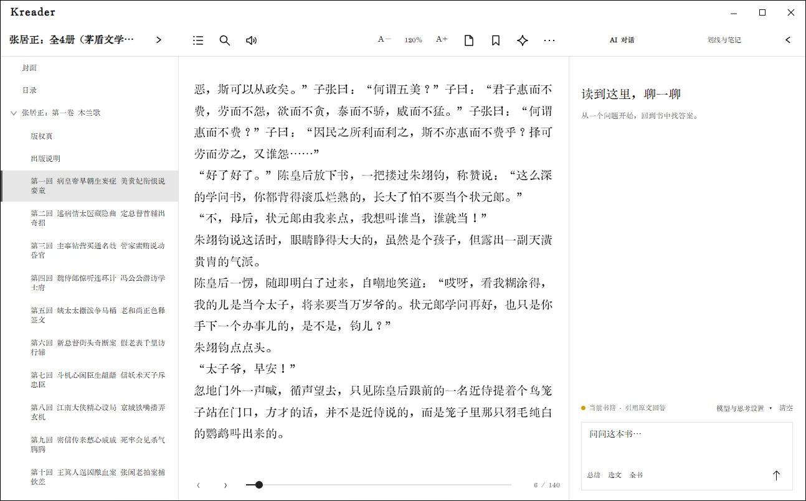

# AI 阅读助手

AI 助手可以围绕当前书籍回答问题、解释选文、总结章节和生成全书概览。先配置服务商，再打开书籍右侧的 AI 对话面板。

## 第一次配置

1. 打开“设置 → 阅读与辅助”，找到 AI 阅读助手区域。
2. 开启“启用 AI 阅读助手”。
3. 选择服务商，填写 API 地址、API Key 和模型名称。使用 OpenAI 兼容接口时，按服务商要求填写完整 API 地址。
4. 点击保存；若服务提供模型列表，可先自动获取，再选择实际可用模型。
5. 点击“测试连接”或连通性检测。通过后打开一本书，在阅读器中展开 AI 面板。

Kkindle 支持 DeepSeek、OpenAI 兼容接口等配置。接口路径、模型名、兼容方式和计费规则由服务商决定；连接失败时先核对地址、模型、网络、账号权限和余额。

## 在阅读时使用

- **自由提问**：在面板输入与当前书籍相关的问题，发送后查看回答。
- **解释选文**：先在正文选择一段文字，再调用解释操作。问题会带上当前选文作为上下文。
- **总结章节**：从总结操作指定章节范围。发送前确认选中的章节和文本范围。
- **全书概览**：适合询问主题、人物关系或整体结构。篇幅较长时等待索引/摘要准备完成。
- **继续追问**：在当前对话中补充条件或要求引用对应段落。

“清空”会清除当前对话内容；书签和阅读批注在阅读器中单独管理。

## 数据范围与隐私

书籍文件和阅读记录默认保存在本机。使用在线 AI 时，Kkindle 会把回答所需的相关本地书籍片段发送到你配置的服务；服务商如何保存和使用这些数据，请以其政策为准。不要发送你无权披露的书籍或个人信息。

API Key 通过系统安全存储管理，不会写进 `.kkindle` 本地书库备份。若更换电脑，需要在新设备重新配置凭据。关闭 Kkindle 的网络功能后，AI 与其他联网功能不可用，本地阅读和已安装的词典仍可使用。
