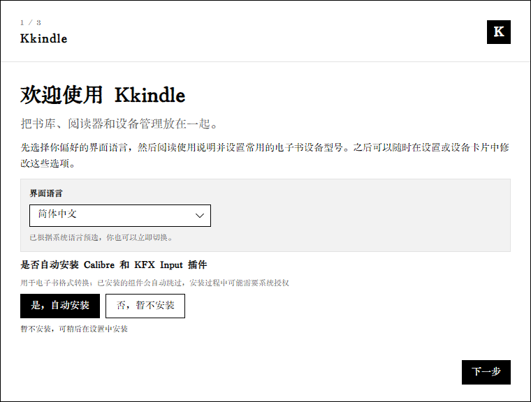

# 安装与初次启动

## 下载正确的版本

1. 打开[官网下载页](https://kkindle.stacker.beauty/#downloads)，下载前先确认系统和处理器架构。
2. Windows 用户可选安装版（按安装向导完成）或便携版（解压后运行 Kkindle）。两种方式都使用本机的数据目录。
3. Linux 用户按发行版选择 `.deb` 或 `tar.gz`，并查看[跨平台说明](https://github.com/kingstacker/Kkindle/blob/master/docs/cross-platform.md)中的系统依赖。
4. macOS 提供 Intel 与 Apple Silicon 版本。按下载页和对应版本发布说明完成首次打开。

也可以从 [GitHub Releases](https://github.com/kingstacker/Kkindle/releases) 下载。请优先查看目标版本的发布说明，再运行安装包。

## 首次运行向导

首次运行时先选择界面语言，然后决定是否安装格式转换相关组件。

Calibre 是可选项。选择“暂不安装”也可以继续建立书库、导入 TXT、阅读 EPUB/PDF 和无 DRM 的 AZW3。以后需要格式转换或 Kindle 词典导入时，再打开“设置 → 书库与导入”配置即可。

## 检查数据目录与依赖

启动后进入“设置 → 关于与更新”，查看版本号和诊断结果。诊断区域可检查数据目录可写状态、PDF 解析器、WebView、Calibre、TTS 和 Kindle 服务。若某项显示未就绪，按该项提示安装依赖或检查权限，再重启 Kkindle。

## 更新软件

在“设置 → 关于与更新”点击“检查更新”。稳定版检查默认开启；若主动启用开发版更新，软件也会检查开发构建。更新后若功能仍显示旧状态，完全退出并重新启动应用。

## Calibre 什么时候需要安装

Calibre 用于电子书格式转换、部分 Kindle 传书格式转换以及 Kindle 词典导入。内置支持的阅读格式和 TXT 导入不要求 Calibre。需要转换时先安装 Calibre，再在“设置 → 书库与导入”确认 `ebook-convert` 路径可用；路径留空时 Kkindle 会尝试自动查找系统安装位置。
