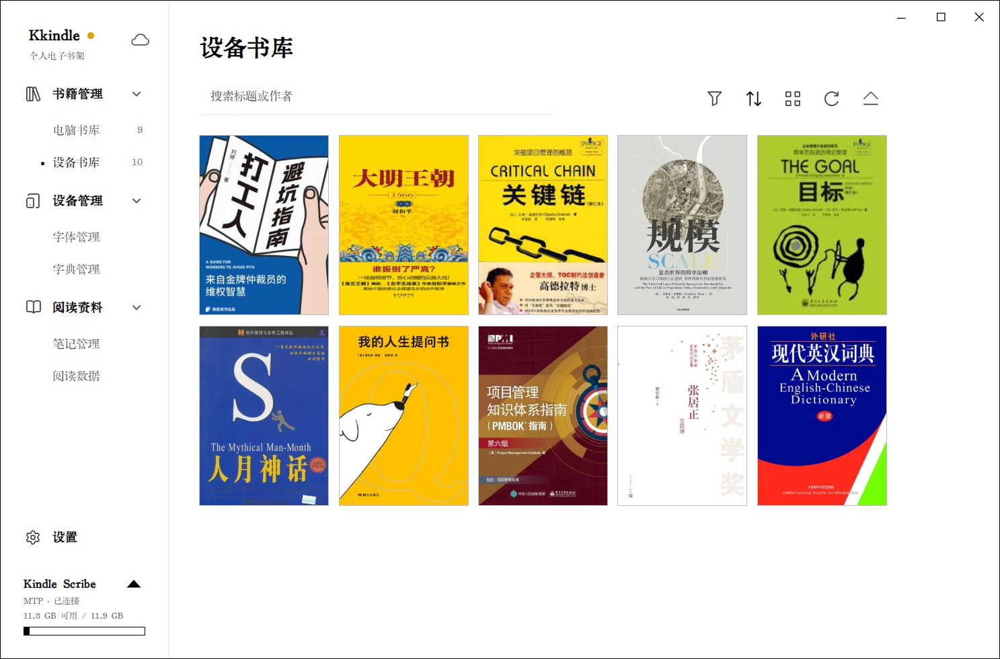

# Kindle 与传书

## 先连接设备

1. 用支持数据传输的 USB 线连接 Kindle，并解锁设备。
2. 在 Kindle 上选择文件传输/USB 模式；只充电模式不能传书。
3. 等待 Kkindle 检测设备。左下角设备卡片会显示设备名称和连接状态。
4. 打开“书籍管理 → 设备书库”确认书籍和容量信息已加载。

软件会通过系统的 USB/WPD/MTP 能力连接设备。若没有设备卡片，先换数据线或 USB 端口、确认设备没有锁屏，再检查“设置 → 关于与更新”中的 Kindle 服务诊断。

## 从电脑书库发送到 Kindle

1. 在“电脑书库”选择一到多本书。
2. 点击“发送到设备”，确认目标设备和书籍列表。
3. 如果某种格式需要转换，Kkindle 会提示或使用已配置的转换工具；EPUB/MOBI 发送到 Kindle 时会转换为兼容的 AZW3。
4. 等待任务完成，不要在传输过程中拔掉设备。
5. 完成后点击“安全弹出设备”，再拔线。之后在 Kindle 书库中刷新或重启设备即可查看新书。

如果目标设备不支持选中的格式，先将书籍转换为受支持格式。格式转换需要 Calibre；转换过程会生成目标格式，不会替换原书。

## 管理设备中的书籍和资源

在设备书库中查看设备书目和可用空间。设备管理区域还可以管理字体、词典等资源。词典会写入 Kindle 的 `documents/dictionaries` 目录；删除前检查 Kindle 当前使用的主词典，避免设备失去默认释义来源。

部分设备只允许读取或导出笔记，不支持从 Kkindle 写回设备。具体能力以连接后识别到的设备为准。

## 两种在线发送入口

**Send to Kindle** 使用 Amazon 在线服务，不需要 USB 连接。首次使用时按提示登录 Amazon，确认文件与账号后发送；Kindle 联网后同步接收。登录和传输都发生在该在线服务中，使用前先核对目标账号。

如果配置了“发送到 Kindle 邮箱”，则走邮件方式。需要在设置中填写发件邮箱及 SMTP/应用专用密码，并核对 Kindle 的收件邮箱和允许的发件地址。密码或应用专用密码只填入 Kkindle 设置，不要写进本地书库或截图。

## 导入 Kindle 摘录

1. 将 Kindle 导出的 `My Clippings.txt` 放到电脑可访问的位置。
2. 在 Kkindle 打开“阅读资料”中的摘录导入功能，选择该文件。
3. 导入后到笔记管理或阅读资料中查找摘录。

导入摘录不会从 Kindle 删除原文件。更换电脑前可将摘录数据包含在本地 `.kkindle` 备份中。
