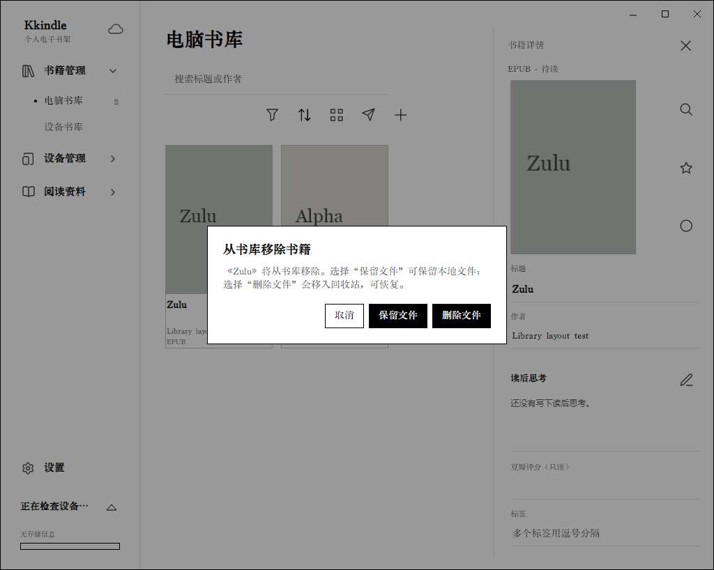

# 书库与导入

## 导入一本书

1. 在左侧打开“书籍管理 → 电脑书库”。
2. 点击书库上方的添加按钮，选择一个或多个文件；也可以将文件拖到书库窗口。
3. 等待导入完成。新书会以书卡显示；导入的书籍文件、封面和书库记录由 Kkindle 管理。

支持 EPUB、PDF、MOBI、AZW3 和 TXT。TXT 导入会检测 UTF-8、带 BOM 的 Unicode、GB18030 等常见编码，识别章节标题和分卷目录并转换为 EPUB。若目录没有按预期生成，先检查文本中的标题是否单独成行、章节编号和卷标题是否清晰。

## 同名书籍如何选择

导入同名书时，根据弹出的选项处理：

- **添加为现有书籍的格式**：同一本书的 EPUB、PDF 等不同格式放在同一条书目下。
- **独立保存**：把修订版、不同译本或不同内容的同名书保留为单独书目。
- **跳过**：不导入这次文件，现有书目保持不变。

导入前看一下文件格式和版本，可以减少后续整理工作。

## 搜索与筛选

- 在搜索框输入书名或作者关键词。
- 点击筛选按钮，按作者、标签、分类、格式、阅读状态等条件缩小结果。
- 使用排序按钮调整顺序，并用网格/列表按钮切换显示方式。
- 清除搜索词或筛选条件即可返回完整书库。

电脑书库和设备书库是两个视图。电脑书库管理本机书目；设备书库显示已连接 Kindle 上的内容。

## 编辑书籍信息

1. 在书库中打开书籍详情。
2. 修改标题、作者、封面、分类或标签。
3. 标签可用逗号分隔多个值；完成后保存修改。

阅读状态和阅读进度由阅读器更新。若同一本书有多个格式，书卡会显示可用格式；打开时按设置的首选格式选择。

## 移除书籍与恢复

移除书籍时先看清选择：

- **保留文件**：从 Kkindle 书库移除记录，磁盘上的书籍文件保留。
- **删除文件**：将书目和文件移入可恢复的回收站。
- **移除单个格式**：只处理选中的格式，其他格式继续保留。

恢复路径是“设置 → 数据与同步 → 回收站”。从回收站恢复后，书籍会回到书库。永久清理后无法通过回收站恢复；本地 `.kkindle` 备份也会保存回收站内容，可用于灾难恢复。
