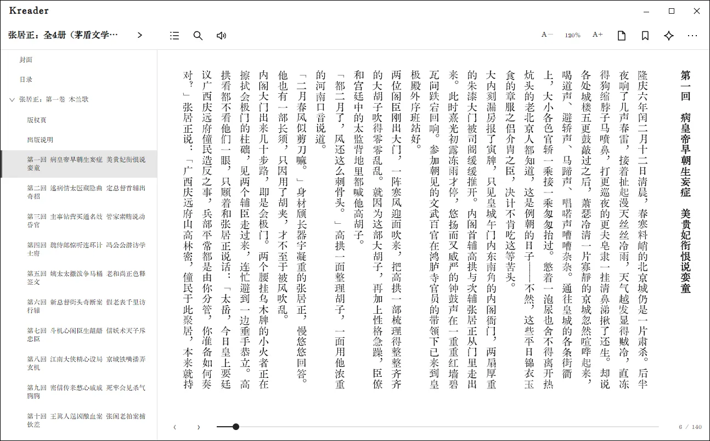
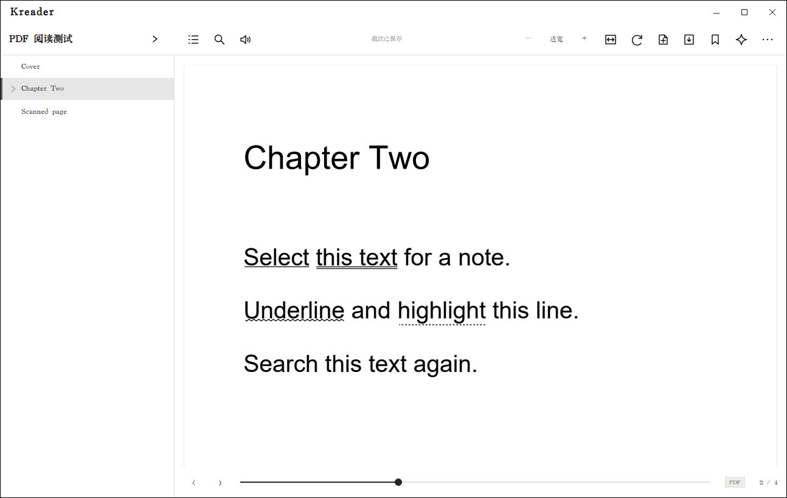

# 阅读与批注

## 打开书籍并恢复进度

在“电脑书库”中打开一本 EPUB、PDF 或无 DRM 的 AZW3。TXT 已在导入时转换为 EPUB。阅读器会保存书签、批注和阅读进度；关闭阅读器后再打开同一本书，会回到上次保存的位置。

## 阅读器工具栏

阅读器顶部从左到右包含书名、目录、搜索、听书、字号/缩放、书签、阅读辅助和更多选项。文件类型不同，工具栏项目会略有区别。

- **目录**：展开章节列表，点击章节标题跳转。PDF 有书签/大纲时可从这里跳转；没有大纲时可用页码导航。
- **搜索**：输入书内词句并查看匹配位置。点击结果跳到正文对应处。
- **翻页与滚动**：按阅读设置使用分页或滚动；窗口底部的进度条用于定位，左右翻页按钮可前后移动。
- **字号与排版**：使用 A−/A+ 或阅读设置调整字号、行距、正文宽度、字体及竖排。排版参数是全局设置，修改后会应用到其他书籍。
- **书签**：在当前位置添加书签；之后从书签列表跳回。
- **更多**：根据格式显示其他阅读操作。

## 划线、标记和文字批注

1. 在正文中选中一段文字。
2. 在出现的工具栏或上下文菜单中选择标记样式，或添加文字批注。
3. 需要补充说明时输入批注内容并保存；只想划线时可以留空。
4. 从“阅读资料 → 笔记管理”查找、修改和整理阅读记录。

选中文字后可查本地词典；百科入口用于打开对应条目。需要针对当前书籍追问时，打开 AI 面板，参阅 [AI 阅读助手](ai.md)。

## PDF 阅读和页面笔记

PDF 阅读器支持连续滚动、单页/双页、适合宽度/整页、缩放和 90° 旋转。文本型 PDF 可全文搜索和选择文字；选中文字后可以划线或添加批注。要给某个图表或页面区域做备注，可用页面笔记工具，或在相应位置打开右键菜单添加页面批注。

扫描版 PDF 是页面图片，可以阅读和添加页面笔记，但 Kkindle 当前没有 OCR，所以无法搜索图片中的文字。

## Windows 听书

1. 在 EPUB 阅读器顶栏点击听书图标。
2. 在听书设置中选择 Windows 已安装的语音；未手动指定时，中文正文会优先尝试中文语音。
3. 开始后当前朗读片段会在阅读器中高亮，可暂停或继续。
4. 勾选“自动朗读下一章”可在章节结束后继续播放。

手动翻章、关闭阅读器或返回书架会停止朗读。听书使用系统 TTS；如果诊断显示 TTS 未就绪，请先检查 Windows 语音组件。
